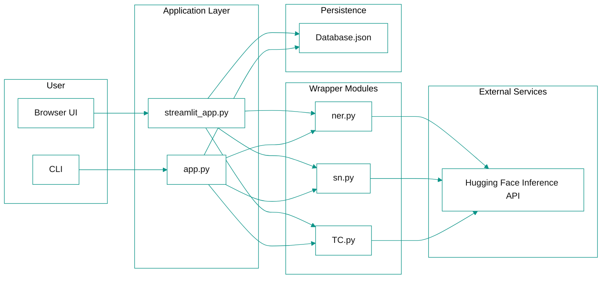

# NLP Toolkit

A web app where a user logs in and can run three NLP tasks on any text: Named Entity Recognition, Sentiment Analysis, and Text Classification. It calls Hugging Face APIs in the backend, with a Streamlit UI on top.

## Features

- 🔐 Simple login/register system (JSON-backed)
- 🏷️ Named Entity Recognition (NER) — detect people, organizations, locations
- 📊 Sentiment Analysis (SA) — positive/negative with confidence score
- 🗂️ Text Classification (TC) — zero-shot classification into custom categories

## Architecture



## Tech stack

- Python 3.10+
- Streamlit for the UI
- Requests + python-dotenv for API calls and configuration
- Hugging Face Inference API for hosted model inference
- Local JSON file for lightweight persistence

## File structure

```
NLP_ToolKit/
├── streamlit_app.py    # Streamlit UI and glue code
├── app.py               # Simple interactive CLI for registration + tool selection
├── ner.py                # HF API wrapper — Named Entity Recognition
├── sn.py                 # HF API wrapper — Sentiment Analysis
├── TC.py                 # HF API wrapper — Text Classification
├── nlp/                  # (optional) helper/consolidated modules
├── Database.json         # Local JSON store for users (demo DB)
├── .env                  # Environment variables — HF_TOKEN (not committed)
├── requirements.txt      # Python dependencies
└── venv/                 # Virtual environment (not committed)
```

## Setup

1. Clone the repo
   ```bash
   git clone https://github.com/KrAtulHub/NLP_ToolKit.git
   cd NLP_ToolKit
   ```

2. Create a virtual environment and install dependencies
   ```bash
   python -m venv venv
   source venv/bin/activate      # Windows: venv\Scripts\activate
   pip install -r requirements.txt
   ```

3. Add your Hugging Face API token
   Create a `.env` file in the project root:
   ```
   HF_TOKEN=your_huggingface_api_token_here
   ```
   Get a free token at https://huggingface.co/settings/tokens

## Usage

**Streamlit UI (recommended):**
```bash
streamlit run streamlit_app.py
```

**CLI version:**
```bash
python app.py
```

## Known limitations

- Passwords are stored in plain text in `Database.json` — fine for a demo, not for production. A real version would hash passwords (e.g. bcrypt) and use a proper database (SQLite/PostgreSQL).
- `Database.json` and `.env` are excluded from version control via `.gitignore`.

## Roadmap

- [ ] Text Summarization
- [ ] Password hashing
- [ ] Deploy to Streamlit Community Cloud / Hugging Face Spaces

## License

MIT