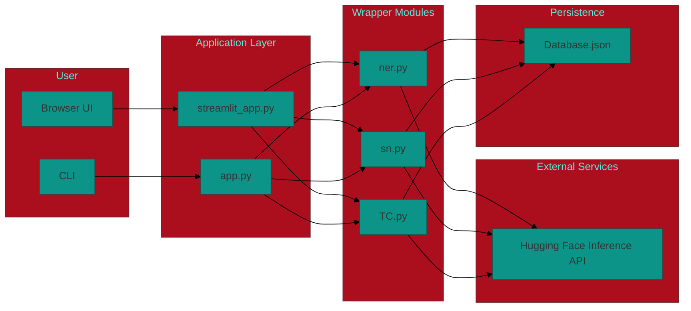

# NLP Toolkit

A web app where a user logs in and can run three NLP tasks on any text: Named Entity Recognition, Sentiment Analysis, and Text Classification. It calls Hugging Face APIs in the backend, with a Streamlit UI on top.

- Named Entity Recognition (NER)
- Sentiment Analysis (SA)
- Text Classification (TC)

## Architecture

## Tech stack

- Python 3.10+
- Streamlit for the UI
- Requests + python-dotenv for API calls and configuration
- Hugging Face Inference API for hosted model inference
- Local JSON file for lightweight persistence

## File structure

- `streamlit_app.py` — Streamlit user interface and glue code.
- `app.py` — Simple interactive CLI for registration + tool selection.
- `ner.py`, `sn.py`, `TC.py` — Top-level HF API wrappers for NER, Sentiment, and Text Classification.
- `nlp/` — (optional) package copies / helpers (was used for consolidation).
- `Database.json` — Local JSON store for users (simple demo DB).
- `.env` — Environment variables (not committed; contains `HF_TOKEN`).
- `requirements.txt` — Python dependencies.
- `venv/` — Virtual environment 